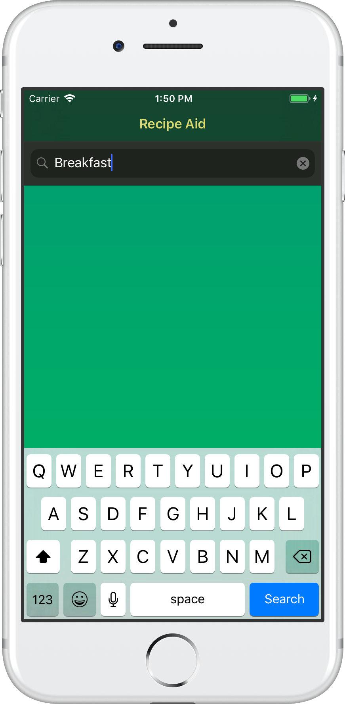
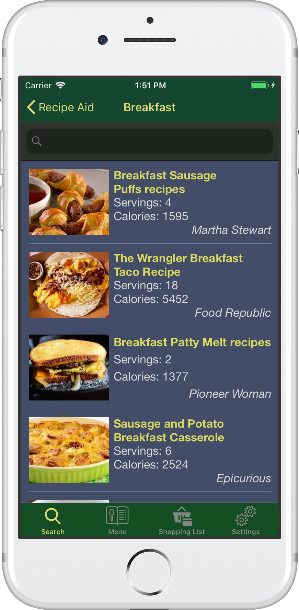
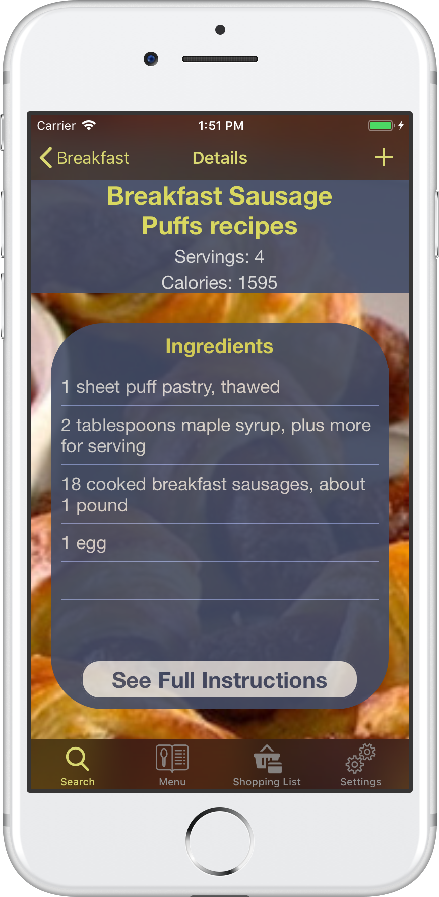
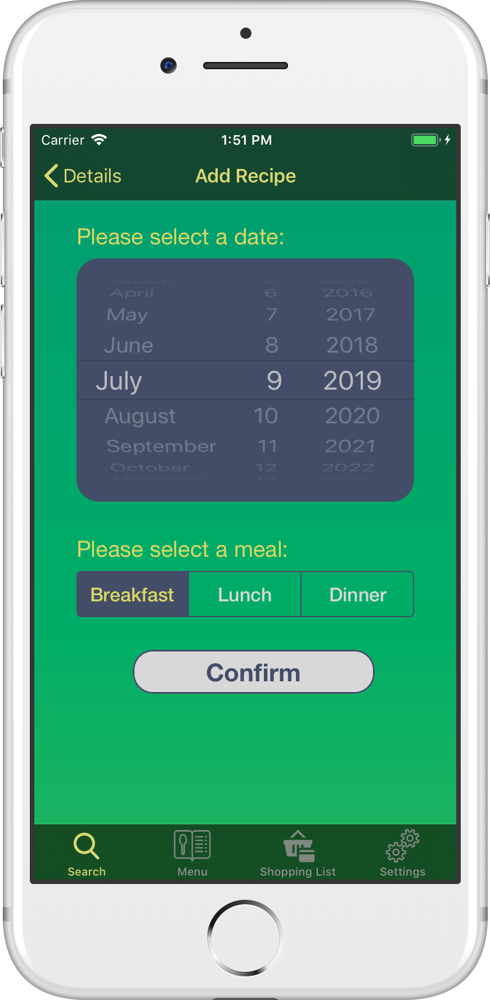

[](https://www.codacy.com/app/meirrosendorff/RecipeAid-IOS?utm_source=github.com&amp;utm_medium=referral&amp;utm_content=meirrosendorff/RecipeAid-IOS&amp;utm_campaign=Badge_Grade)   [](https://app.bitrise.io/app/48ae1ef123f93da9)    [](https://codecov.io/gh/meirrosendorff/RecipeAid-IOS)

# RecipeAid

Awesome IOS tool for finding top recipes and setting your dinner schedule for the week!

## Getting Started

### iPhone Installation

For installation download the app from appcenter at install.appcenter.ms/users/meir.rosendorff/apps/recipeaid-ios/distribution_groups/alphatesters.

### Development Prerequisites

```
swift 5
xcode 10
```

### Pods
```
Alamofire - simplifies networking
SwiftyJSON - simplifies JSON parsing
Hippolyte - Network stubbing during tests
Cuckoo - Object Mocking
```

## Usage

### What you can do on the app

#### Search For Recipes and Add them to your Menu

       
