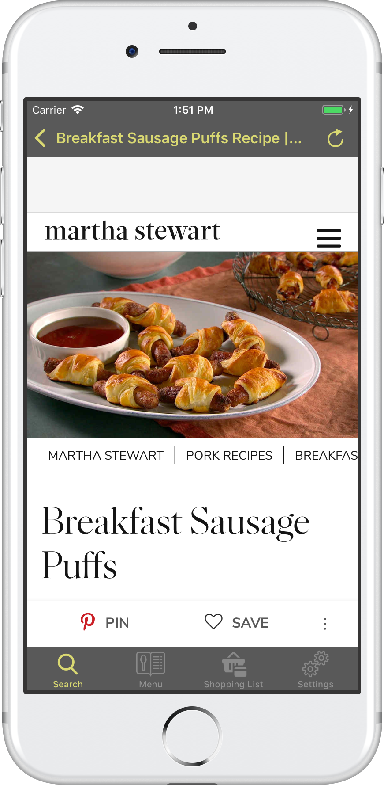
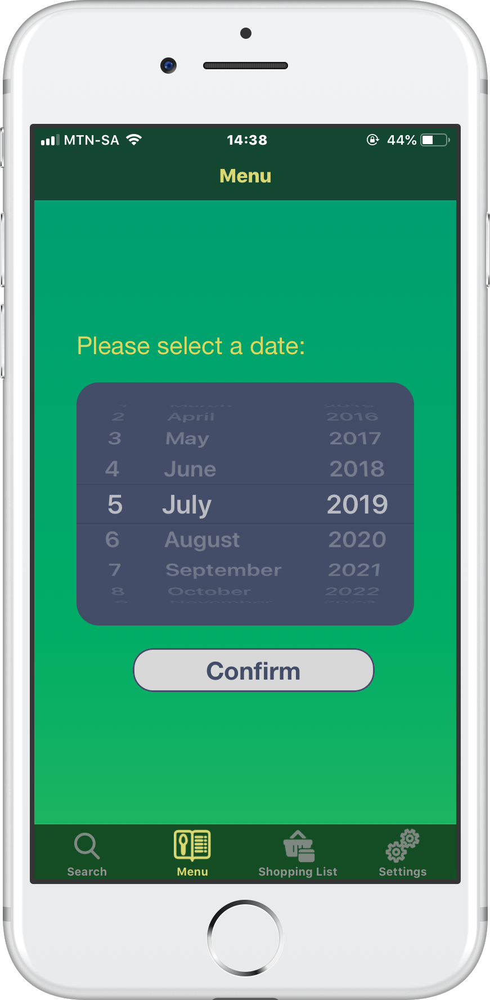
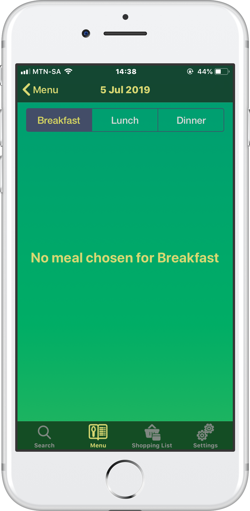
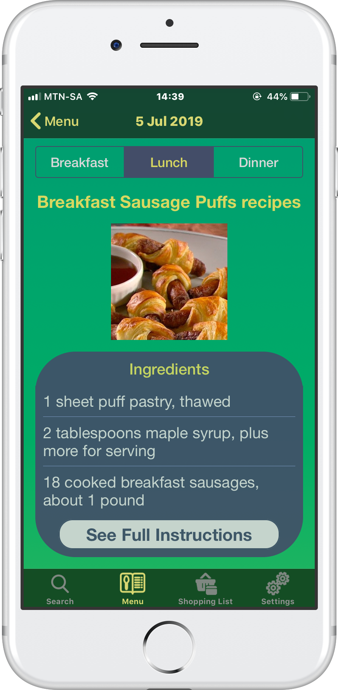
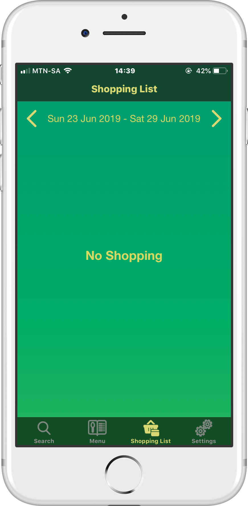
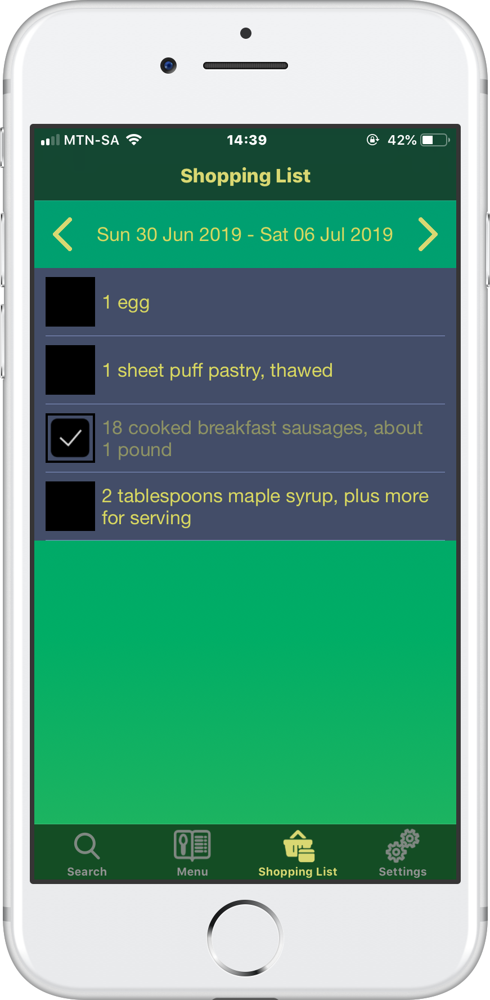
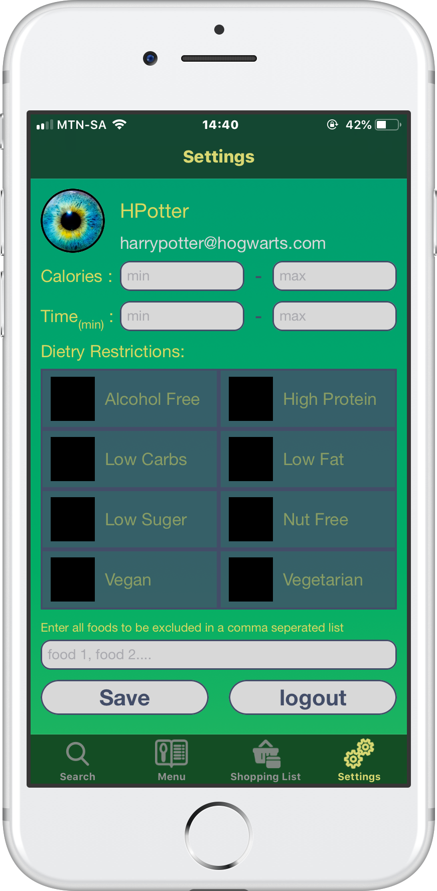

[](https://www.codacy.com/app/meirrosendorff/RecipeAid-IOS?utm_source=github.com&amp;utm_medium=referral&amp;utm_content=meirrosendorff/RecipeAid-IOS&amp;utm_campaign=Badge_Grade)   [](https://app.bitrise.io/app/48ae1ef123f93da9)    [](https://codecov.io/gh/meirrosendorff/RecipeAid-IOS)

# RecipeAid

Awesome IOS tool for finding top recipes and setting your dinner schedule for the week!

## Getting Started

### iPhone Installation

For installation download the app from [appcenter](install.appcenter.ms/users/meir.rosendorff/apps/recipeaid-ios/distribution_groups/alphatesters).

### Development Prerequisites

```
swift 5
xcode 10
```

### Pods
```
Alamofire - simplifies networking
SwiftyJSON - simplifies JSON parsing
Hippolyte - Network stubbing during tests
Cuckoo - Object Mocking
```

## Usage

### What you can do on the app

#### 1. Search For Recipes and Add them to your Menu

<table>
  <tr>
    <th>
      Search
    </th>
    <th>
      View Results
    </th>
    <th>
      View Details
    </th>
    <th>
      View Instructions
    </th>
    <th>
      Add To Menu
    </th>
  </tr>
  <tr>
    <td>
      
    </td>
    <td>
       
    </td>
    <td>
      
    </td>
    <td>
      
    </td>
    <td>
      
    </td>
  </tr>
</table>

#### 2. View your menu on each day

<table>
  <tr>
    <th>
      Choose Date
    </th>
    <th>
      No Meals Chosen yet
    </th>
    <th>
      Meal Details
      If Chosen
    </th>
  </tr>
  <tr>
    <td>
      
    </td>
    <td>
    
    </td>
    <td>
    
    </td>
  </tr>
</table>

#### 3. View your shopping list for each week

<table>
  <tr>
    <th>
      No Shopping For This Week
    </th>
    <th>
      Shopping For This week
    </th>
  </tr>
  <tr>
    <td>
    
    </td>
    <td>
      
    </td>
  </tr>
</table>

#### 4. Set your personal preferances

<table>
  <tr>
    <th>
      Settings
    </th>
  </tr>
  <tr>
    <td>
      
    </td>
  </tr>
</table>

## Updates

Any and all sugestions for new features will be considered, if you have one please log an issue!

## Acknowledgments

I would like to extend a massive thank you to the following, without you this app would not be possible:

* Google.com 
* Stack Overflow
* PJ
